# Quadrature Hybrid Design Summary

This repository contains MATLAB tooling for comparing measured and simulated S-parameters of a quadrature hybrid. The pipeline ingests VNA touchstone files alongside simulator exports, aligns the data to global S-parameter labels, and produces side-by-side comparison plots.

## Design Criteria

- **Center frequency:** 2.45 GHz.
- **Return loss at all ports:** S11, S22, S33, S44 < -25 dB at 2.45 GHz.
- **Power division:** S21 and S31 > -3.5 dB at 2.45 GHz.
- **Isolation:** S41 < -30 dB at 2.45 GHz.
- **Phase balance:** Angle(S21) – Angle(S31) = 90° at 2.45 GHz.

| Layout                                                   | Schematic                                                      | Simulation Overview                                                |
| -------------------------------------------------------- | -------------------------------------------------------------- | ------------------------------------------------------------------ |
| 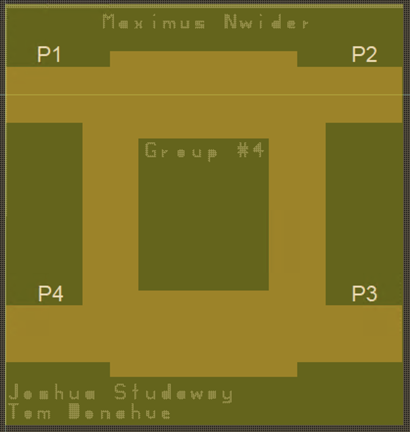 |  |  |

## Repository layout

- `main.m` — entry point that sets up paths, loads configuration, and launches the pipeline.
- `run_sparam_project.m` — orchestrates file discovery, measurement/simulation alignment, and plotting.
- `+config/` — default configuration values (paths, plotting options, axis limits).
- `+io/` — parsers for measurement (`*.s2p`) and simulation (`*.txt`/`*.tab`/`*.dat`) data.
- `+plotting/` — routines that generate comparison figures and save them to `output/`.
- `+util/` — helpers for path management and filename parsing.
- `+data/` — sample measurement and simulation files for local runs.
- `output/` — generated figures (`Sij.png`) for each available S-parameter.
- `QuadratureHybrid_*.png` — reference layout, schematic, and simulation overview images.

## Design Criteria

## Running the code

1. Open MATLAB and change into the repository folder.
2. Run the project entry point:
   ```matlab
   >> main
   ```
   The script will read measurement and simulation files from the configured directories, then write comparison plots to `output/`.

## Measurement vs. Simulation

The following matrix displays every generated S-parameter figure found in `output/`.

| S11                    | S12                    | S13                    | S14                    |
| ---------------------- | ---------------------- | ---------------------- | ---------------------- |
| 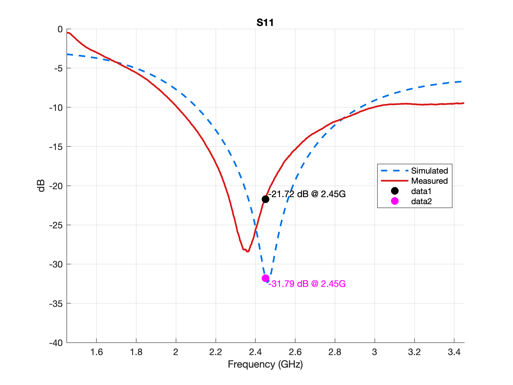 | 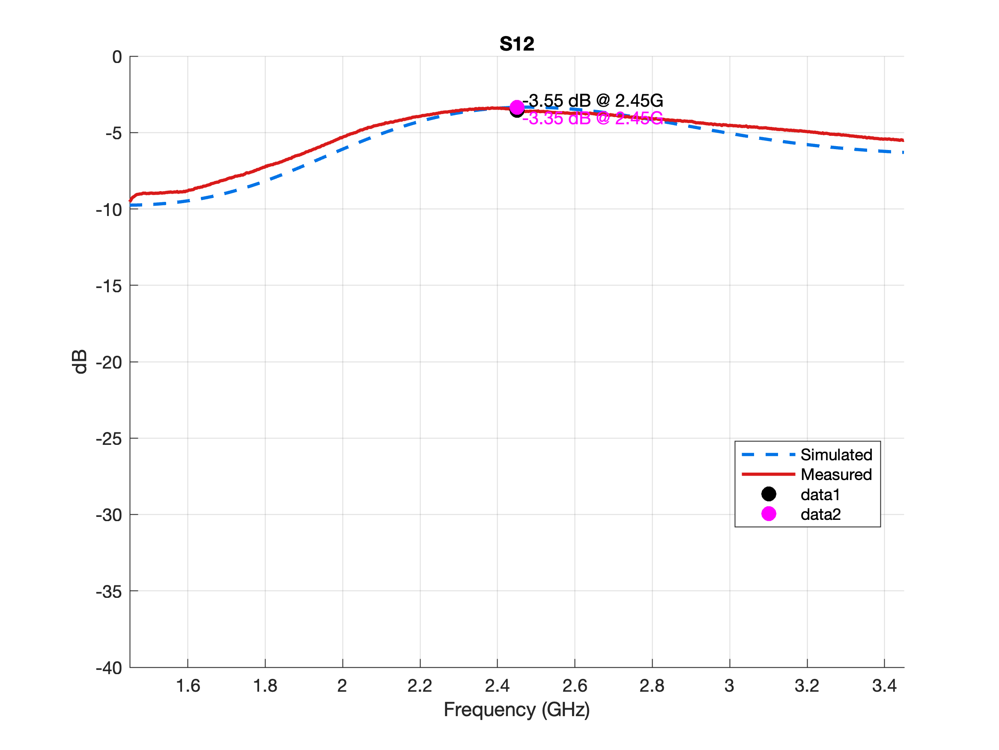 | 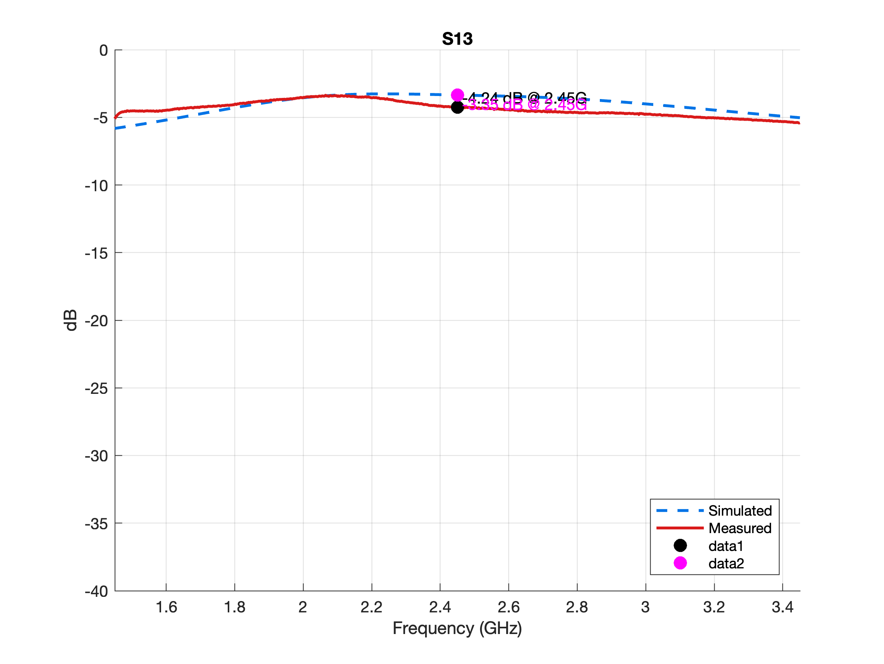 | 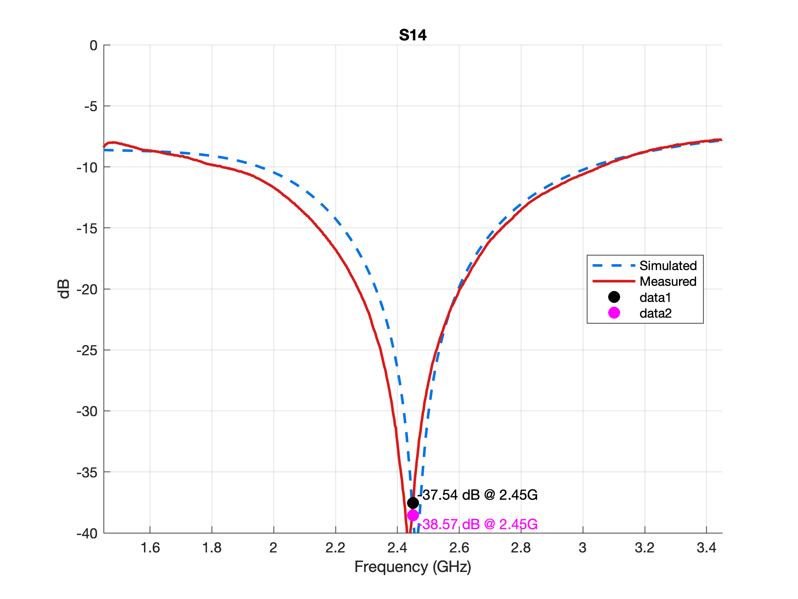 |
| S21                    | S22                    | S23                    | S31                    |
| ---                    | ---                    | ---                    | ---                    |
| 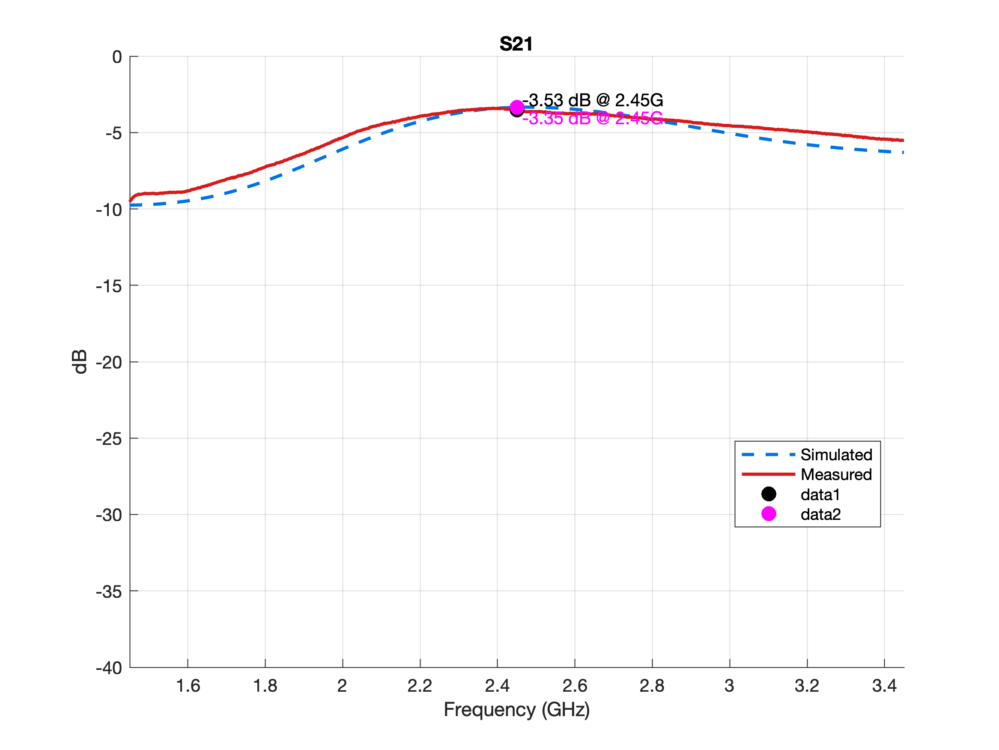 | 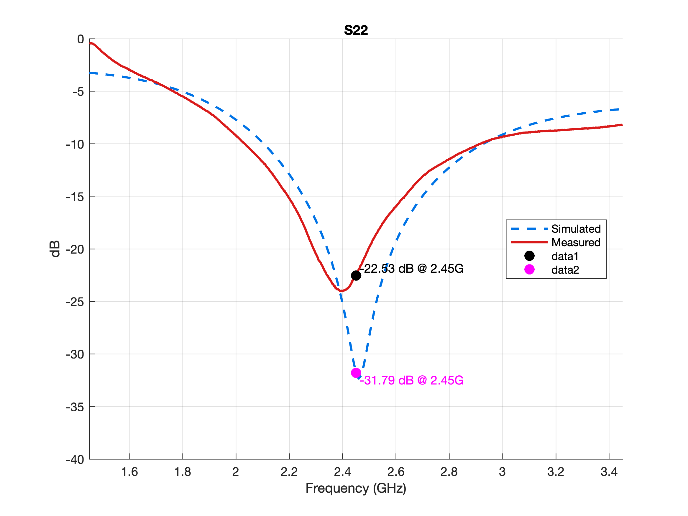 | 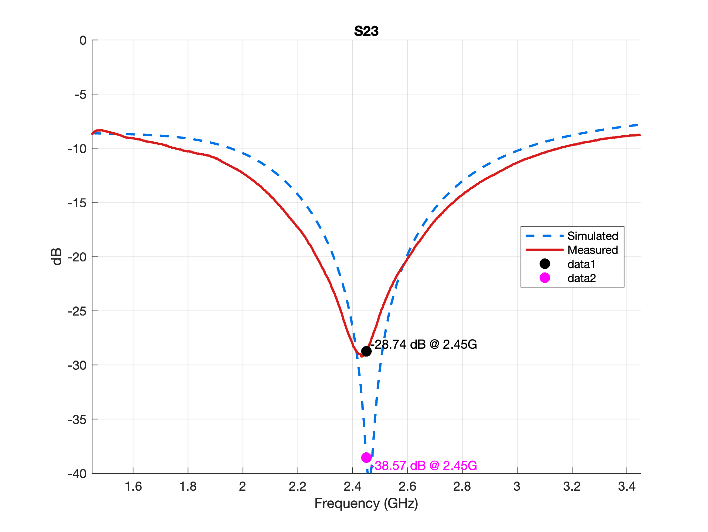 |  |
| S32                    | S33                    | S41                    | S44                    |
| ---                    | ---                    | ---                    | ---                    |
| 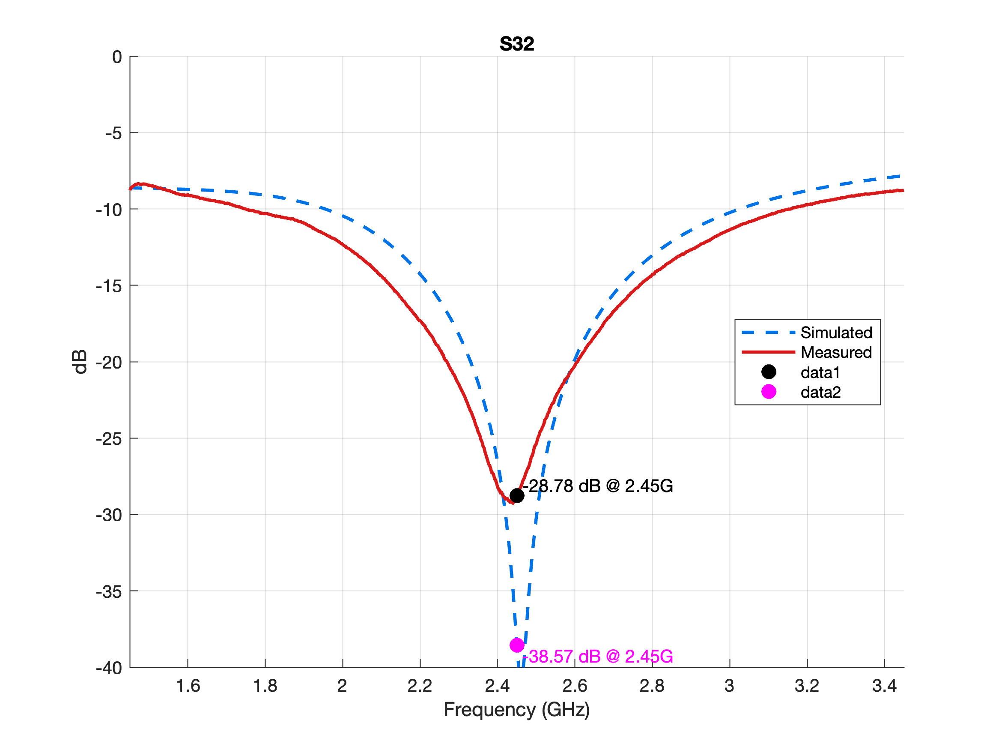 | 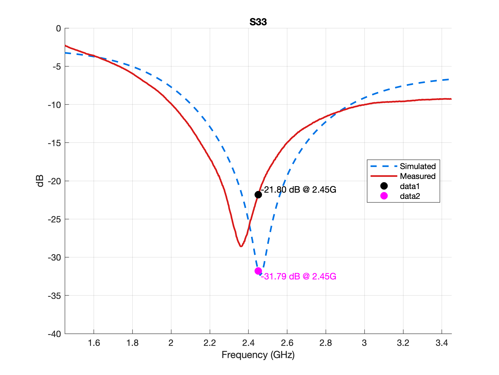 |  | 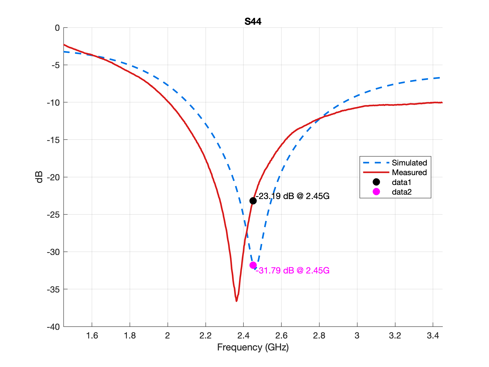 |
